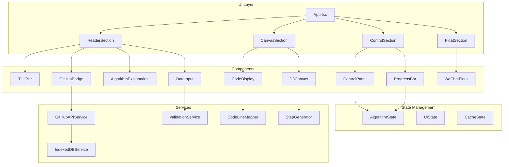

# Design Document

## Overview

本设计文档描述了 LeetCode 283 "移动零" 算法可视化教学网站的技术架构和实现方案。该项目基于现有的 TypeScript + React + D3.js 技术栈，通过增强现有组件和添加新功能来实现完整的算法教学可视化体验。

核心设计目标：
- **单屏幕体验**：所有功能在一个页面内完成，无需滚动
- **分步动画**：算法执行过程以分镜形式展示，每步与代码行精确对应
- **交互式画布**：支持拖拽、缩放的 D3.js 可视化画布
- **多语言支持**：Java、Python、Golang、JavaScript 四种语言代码展示
- **本地持久化**：使用 IndexedDB 缓存用户偏好和 API 数据

## Architecture



### 目录结构

```
src/
├── components/
│   ├── header/
│   │   ├── TitleBar.tsx              # 标题栏组件
│   │   ├── GitHubBadge.tsx           # GitHub徽标组件
│   │   ├── AlgorithmExplanation.tsx  # 算法思路弹窗
│   │   └── DataInput.tsx             # 数据输入组件
│   ├── canvas/
│   │   ├── D3Canvas.tsx              # D3画布主组件
│   │   ├── ArrayRenderer.tsx         # 数组渲染器
│   │   ├── PointerRenderer.tsx       # 指针渲染器
│   │   ├── ArrowRenderer.tsx         # 箭头渲染器
│   │   └── AnnotationRenderer.tsx    # 标注渲染器
│   ├── code/
│   │   ├── CodeDisplay.tsx           # 代码展示组件
│   │   ├── LanguageSelector.tsx      # 语言选择器
│   │   ├── LineHighlighter.tsx       # 行高亮组件
│   │   └── VariableDisplay.tsx       # 变量值显示
│   ├── controls/
│   │   ├── ControlPanel.tsx          # 控制面板
│   │   ├── ProgressBar.tsx           # 进度条组件
│   │   └── SpeedSelector.tsx         # 速度选择器
│   └── float/
│       └── WeChatFloat.tsx           # 微信悬浮球
├── services/
│   ├── IndexedDBService.ts           # IndexedDB服务
│   ├── GitHubAPIService.ts           # GitHub API服务
│   └── ValidationService.ts          # 数据验证服务
├── utils/
│   ├── stepGenerator.ts              # 步骤生成器
│   ├── codeLineMapper.ts             # 代码行映射
│   └── colorScheme.ts                # 配色方案
├── types/
│   └── index.ts                      # 类型定义
└── hooks/
    ├── useAlgorithmState.ts          # 算法状态Hook
    ├── useKeyboardControls.ts        # 键盘控制Hook
    └── useIndexedDB.ts               # IndexedDB Hook
```

## Components and Interfaces

### 1. TitleBar 组件

```typescript
interface TitleBarProps {
  problemNumber: number;      // 题目编号: 283
  problemTitle: string;       // 题目标题: "移动零"
  leetCodeUrl: string;        // LeetCode链接
}
```

功能：
- 显示题目编号和中文标题
- 点击跳转到 LeetCode 题目页面（新标签页）
- 设置浏览器标签页标题

### 2. GitHubBadge 组件

```typescript
interface GitHubBadgeProps {
  repoUrl: string;            // 仓库URL
  owner: string;              // 仓库所有者: "fuck-algorithm"
  repo: string;               // 仓库名: "leetcode-283-move-zeroes"
}

interface GitHubBadgeState {
  starCount: number;          // Star数量
  isLoading: boolean;         // 加载状态
  error: string | null;       // 错误信息
}
```

功能：
- 显示 GitHub 图标
- 获取并显示 Star 数量
- 使用 IndexedDB 缓存（1小时有效期）
- 悬停显示提示文字

### 3. AlgorithmExplanation 组件

```typescript
interface AlgorithmExplanationProps {
  isOpen: boolean;
  onClose: () => void;
}
```

功能：
- 弹窗展示算法思路
- 支持点击外部或 ESC 关闭
- 展示双指针交换法原理

### 4. DataInput 组件

```typescript
interface DataInputProps {
  onArrayChange: (array: number[]) => void;
  initialArray: number[];
}

interface PresetExample {
  label: string;
  data: number[];
}
```

功能：
- 自定义数据输入框
- 预设样例按钮（平铺展示）
- 随机生成按钮
- 输入验证与错误提示

### 5. CodeDisplay 组件

```typescript
interface CodeDisplayProps {
  language: SupportedLanguage;
  currentStep: AlgorithmStep;
  onLanguageChange: (lang: SupportedLanguage) => void;
}

type SupportedLanguage = 'java' | 'python' | 'golang' | 'javascript';

interface CodeLine {
  lineNumber: number;
  content: string;
  isHighlighted: boolean;
  variables?: VariableValue[];
}

interface VariableValue {
  name: string;
  value: string | number | number[];
}
```

功能：
- 多语言代码展示
- 语法高亮
- 当前执行行高亮
- 变量值内联显示
- 行号显示

### 6. D3Canvas 组件

```typescript
interface D3CanvasProps {
  step: AlgorithmStep;
  width: number;
  height: number;
  onZoom?: (transform: d3.ZoomTransform) => void;
}

interface CanvasElement {
  type: 'array' | 'pointer' | 'arrow' | 'annotation';
  id: string;
  position: { x: number; y: number };
  data: any;
}
```

功能：
- D3.js 渲染数组元素
- 指针位置标识
- 交换动画与箭头
- 拖拽和缩放支持
- 自适应布局

### 7. ControlPanel 组件

```typescript
interface ControlPanelProps {
  isPlaying: boolean;
  canStepBackward: boolean;
  canStepForward: boolean;
  speed: number;
  onPlay: () => void;
  onPause: () => void;
  onStepForward: () => void;
  onStepBackward: () => void;
  onReset: () => void;
  onSpeedChange: (speed: number) => void;
}
```

功能：
- 播放/暂停按钮（空格键）
- 上一步/下一步按钮（方向键）
- 重置按钮（R键）
- 速度选择器
- 快捷键提示文字

### 8. ProgressBar 组件

```typescript
interface ProgressBarProps {
  currentStep: number;
  totalSteps: number;
  onSeek: (step: number) => void;
}
```

功能：
- 显示播放进度
- 已播放部分绿色，未播放灰色
- 支持拖拽跳转

### 9. WeChatFloat 组件

```typescript
interface WeChatFloatProps {
  qrCodeUrl: string;
  promptText: string;
}
```

功能：
- 右下角悬浮球
- 悬停显示二维码
- 保持图片原始比例

## Data Models

### AlgorithmStep 数据模型

```typescript
interface AlgorithmStep {
  id: number;                           // 步骤ID
  array: number[];                      // 当前数组状态
  slowPointer: number;                  // 慢指针位置
  fastPointer: number;                  // 快指针位置
  action: StepAction;                   // 操作类型
  description: string;                  // 步骤描述
  codeLines: CodeLineBinding;           // 代码行绑定
  variables: VariableSnapshot;          // 变量快照
  animation?: AnimationConfig;          // 动画配置
}

type StepAction = 
  | 'init'           // 初始化
  | 'compare'        // 比较元素
  | 'swap'           // 交换元素
  | 'move_slow'      // 移动慢指针
  | 'move_fast'      // 移动快指针
  | 'complete';      // 完成

interface CodeLineBinding {
  java: number[];
  python: number[];
  golang: number[];
  javascript: number[];
}

interface VariableSnapshot {
  slow: number;
  fast: number;
  nums: number[];
  swapCount?: number;
}

interface AnimationConfig {
  type: 'swap' | 'highlight' | 'move';
  fromIndex?: number;
  toIndex?: number;
  duration: number;
}
```

### IndexedDB 数据模型

```typescript
interface CacheEntry<T> {
  key: string;
  value: T;
  timestamp: number;
  expiresAt: number;
}

interface UserPreferences {
  language: SupportedLanguage;
  playbackSpeed: number;
  lastUpdated: number;
}

interface GitHubCache {
  starCount: number;
  fetchedAt: number;
  expiresAt: number;
}
```

### 验证规则数据模型

```typescript
interface ValidationResult {
  isValid: boolean;
  error?: string;
  sanitizedValue?: number[];
}

interface ValidationRules {
  minLength: number;        // 1
  maxLength: number;        // 10000
  minValue: number;         // -2^31
  maxValue: number;         // 2^31 - 1
}
```


## Correctness Properties

*A property is a characteristic or behavior that should hold true across all valid executions of a system-essentially, a formal statement about what the system should do. Properties serve as the bridge between human-readable specifications and machine-verifiable correctness guarantees.*

### Property 1: Input Validation Correctness
*For any* user input string, the validation service should correctly identify whether it represents a valid comma-separated list of integers within the LeetCode constraints (length 1-10000, values within 32-bit signed integer range), and reject invalid inputs with appropriate error messages.
**Validates: Requirements 4.2, 4.3, 4.4, 4.5**

### Property 2: Random Array Generation Validity
*For any* randomly generated array, it should conform to the specified constraints: length between 1 and 20, element values between -100 and 100, and contain at least one zero element.
**Validates: Requirements 4.8, 4.9**

### Property 3: IndexedDB Cache Expiration
*For any* cached value stored in IndexedDB, if the cache timestamp is within one hour of the current time, the cached value should be returned; otherwise, a fresh fetch should be triggered.
**Validates: Requirements 2.4, 2.5**

### Property 4: Language Preference Persistence Round-Trip
*For any* language selection made by the user, storing it to IndexedDB and then retrieving it should return the same language value.
**Validates: Requirements 5.4**

### Property 5: Speed Preference Persistence Round-Trip
*For any* playback speed selection made by the user, storing it to IndexedDB and then retrieving it should return the same speed value.
**Validates: Requirements 7.10**

### Property 6: Step-Code Line Binding Consistency
*For any* algorithm step and any supported language, the step should have valid code line bindings, and switching languages should maintain the correct step-to-line mapping for the current step.
**Validates: Requirements 5.5, 9.2, 9.3, 9.4**

### Property 7: Keyboard Control State Transitions
*For any* keyboard input (left arrow, right arrow, space, R key), the algorithm state should transition correctly: left arrow decreases step (if not at start), right arrow increases step (if not at end), space toggles play/pause, R resets to initial state.
**Validates: Requirements 7.5, 7.6, 7.7, 7.8**

### Property 8: Progress Bar Seek Accuracy
*For any* drag position on the progress bar (0-100%), the algorithm should jump to the corresponding step position (step = floor(position * totalSteps / 100)).
**Validates: Requirements 7.13**

### Property 9: Array Element Coloring Consistency
*For any* algorithm step, array elements with value 0 should be rendered in gray, and non-zero elements should be rendered in blue.
**Validates: Requirements 6.3**

### Property 10: Pointer Position Accuracy
*For any* algorithm step, the slow and fast pointer indicators should be positioned at the correct array indices as specified in the step's variable snapshot.
**Validates: Requirements 6.4**

### Property 11: Step Generation Completeness
*For any* input array, the step generator should produce a complete sequence of steps covering initialization, all comparisons, all swaps, all pointer movements, and completion, with no missing intermediate states.
**Validates: Requirements 9.1**

### Property 12: Variable Display Accuracy
*For any* algorithm step, the displayed variable values (slow, fast, nums) should exactly match the values in the step's variable snapshot.
**Validates: Requirements 5.6**

### Property 13: No Purple Color Constraint
*For any* rendered element in the application, the computed color values should not contain purple hues (no RGB values where R and B are both high while G is low).
**Validates: Requirements 10.2**

### Property 14: Canvas Auto-Scale Fit
*For any* array size, the canvas should auto-scale such that all elements are visible within the viewport without requiring scrolling.
**Validates: Requirements 6.8**

### Property 15: Element Non-Overlap
*For any* array displayed on the canvas, no two elements should have overlapping bounding boxes.
**Validates: Requirements 6.7**

## Error Handling

### API Error Handling
- **GitHub API Failure**: When the GitHub API request fails, the system falls back to cached IndexedDB data. If no cache exists, display "0" as the default star count.
- **Network Timeout**: Set a 5-second timeout for API requests; on timeout, treat as failure and use fallback.

### Input Validation Errors
- **Invalid Format**: Display inline error message "请输入逗号分隔的整数，如: 0,1,0,3,12"
- **Array Too Long**: Display "数组长度不能超过10000"
- **Array Too Short**: Display "数组不能为空"
- **Value Out of Range**: Display "数值超出32位整数范围"
- **Invalid Characters**: Display "包含非法字符，请只输入数字和逗号"

### IndexedDB Errors
- **Storage Unavailable**: If IndexedDB is not available (private browsing), gracefully degrade to in-memory storage for the session.
- **Quota Exceeded**: Clear old cache entries and retry storage operation.

### Animation Errors
- **Invalid Step Index**: Clamp step index to valid range [0, totalSteps - 1].
- **Missing Step Data**: Skip to next valid step and log warning.

## Testing Strategy

### Unit Testing
Unit tests will cover specific examples and edge cases:
- Title component renders correct text and links
- GitHub badge displays correctly with mocked API responses
- Modal opens and closes correctly
- Preset buttons populate correct data
- Language selector shows all four options
- Control buttons have correct labels and shortcuts

### Property-Based Testing
Property-based tests will use **fast-check** library to verify universal properties:

Each property test should:
- Run a minimum of 100 iterations
- Be tagged with the format: `**Feature: algorithm-visualizer-enhancement, Property {number}: {property_text}**`
- Reference the specific correctness property from this design document

**Test Configuration:**
```typescript
import fc from 'fast-check';

// Configure minimum iterations
fc.configureGlobal({ numRuns: 100 });
```

**Property Test Examples:**

1. **Validation Property Test**: Generate random strings and verify validation correctly accepts/rejects based on format rules.

2. **Random Generation Property Test**: Generate multiple random arrays and verify all conform to constraints.

3. **Cache Round-Trip Test**: Store and retrieve values, verify equality.

4. **Step-Code Binding Test**: For generated steps and all languages, verify bindings exist and are valid line numbers.

5. **Keyboard Control Test**: Simulate keyboard events and verify state transitions.

6. **Color Constraint Test**: Render elements and verify no purple colors in computed styles.

### Integration Testing
- Full workflow: input data → generate steps → play animation → verify canvas updates
- Language switching during playback maintains correct state
- Progress bar drag updates both canvas and code display

### Visual Regression Testing
- Screenshot comparison for canvas rendering with known inputs
- Verify layout remains single-screen across viewport sizes
